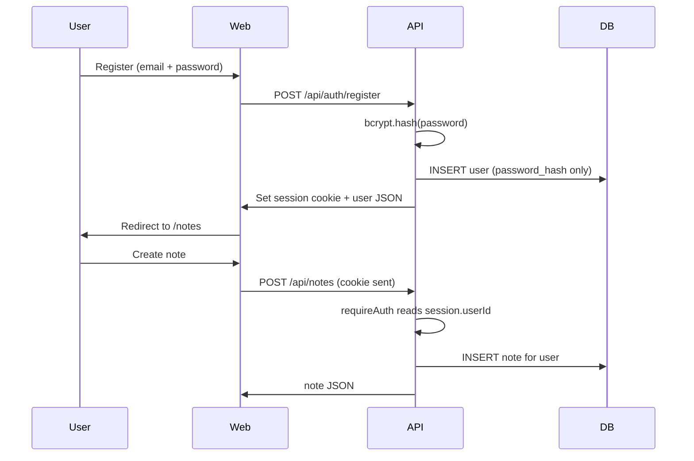

# Project 1: Username + Password Authentication

Learn how users prove identity with something they **know** — and why passwords must never be stored in plain text.

## What we built

| Piece | Location |
|-------|----------|
| Password hashing (bcrypt) | `apps/api/src/lib/password.ts` |
| User storage (SQLite) | `apps/api/src/db/`, `repositories/users.ts` |
| Register / login routes | `apps/api/src/routes/auth.ts` |
| Protected notes | `apps/api/src/middleware/requireAuth.ts` |
| Login & register UI | `apps/web/src/pages/` |

## Flow



## Key concepts

### 1. Never store plain-text passwords

When a user registers, we run:

```
password → bcrypt (salt + hash) → password_hash → database
```

The original password is discarded. Even if the database leaks, attackers get hashes — not passwords.

### 2. Login verifies, it does not "decrypt"

bcrypt is one-way. On login we:

```
submitted password + stored hash → bcrypt.compare → true/false
```

### 3. Generic error messages

Failed login returns `"Invalid email or password"` — we don't reveal whether the email exists (prevents account enumeration).

### 4. Sessions (preview of Project 2)

After successful register/login, we set `req.session.userId`. The browser receives an HttpOnly cookie. Subsequent requests include that cookie automatically.

Project 2 will go deep on session cookies, CSRF, and logout semantics.

## API endpoints

| Method | Path | Auth | Description |
|--------|------|------|-------------|
| POST | `/api/auth/register` | No | Create account, hash password, start session |
| POST | `/api/auth/login` | No | Verify password, start session |
| POST | `/api/auth/logout` | Yes | Destroy session |
| GET | `/api/auth/me` | No* | Return current user or `null` |
| GET | `/api/notes` | Yes | List user's notes |
| POST | `/api/notes` | Yes | Create a note |

\* `/me` is public but returns `user: null` when not logged in.

## Try it

```bash
npm run dev
```

1. Open http://localhost:5173/register
2. Create an account (password ≥ 8 chars)
3. Add notes at http://localhost:5173/notes
4. Log out and confirm `/notes` redirects to login

## What you should notice

- Password never appears in API responses
- `users` table has `password_hash`, not `password`
- Notes belong to the logged-in user only
- Refreshing the page keeps you logged in (session cookie)

## Next: Project 2 — Session cookies

We'll study *how* the session cookie works: HttpOnly, SameSite, CSRF, and what happens on logout.
