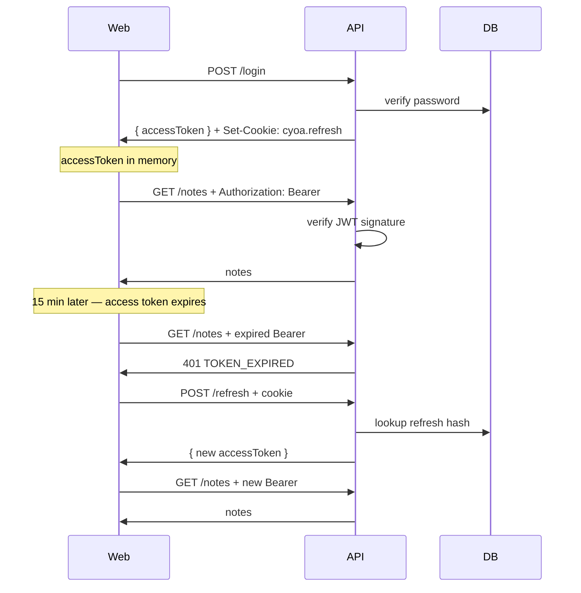

# Project 3: JWT Access + Refresh Tokens

Learn **stateless authentication** — identity encoded in signed tokens instead of server-side sessions.

## What changed from Project 2

| Project 2 (Sessions) | Project 3 (JWT) |
|----------------------|-----------------|
| `connect.sid` cookie on every request | `Authorization: Bearer` header on API calls |
| Server stores session in SQLite | Access token is self-contained (stateless) |
| CSRF token required | CSRF not needed for Bearer tokens |
| Logout destroys session instantly | Logout revokes refresh token; access token expires in 15 min |

## Two-token pattern

```
┌─────────────────────────────────────────────────────────────┐
│  ACCESS TOKEN (JWT, 15 min)                                 │
│  • Stored in JavaScript memory                              │
│  • Sent on EVERY API request: Authorization: Bearer <jwt>   │
│  • Contains userId in signed payload                        │
│  • Server verifies signature — no DB lookup                 │
└─────────────────────────────────────────────────────────────┘

┌─────────────────────────────────────────────────────────────┐
│  REFRESH TOKEN (opaque, 7 days)                             │
│  • Stored in HttpOnly cookie (cyoa.refresh)                 │
│  • Hashed copy in SQLite (revocable on logout)              │
│  • Sent ONLY to POST /api/auth/refresh                      │
│  • Used to get a new access token when the old one expires  │
└─────────────────────────────────────────────────────────────┘
```

## Flow



## Key concepts

### 1. JWT structure

A JWT has three parts separated by dots:

```
eyJhbG...header   .   eyJhbG...payload   .   SflKx...signature
```

- **Header** — algorithm (HS256)
- **Payload** — claims (`sub`: userId, `exp`: expiry)
- **Signature** — proves the token wasn't tampered with

The server never stores the access token — it verifies the signature using `JWT_ACCESS_SECRET`.

### 2. Why two tokens?

| If we only had one long-lived JWT | Problem |
|-----------------------------------|---------|
| Stored in memory | Lost on refresh → login again |
| Stored in localStorage | XSS can steal it |
| Short-lived only | User logged out every 15 min |

**Solution:** short access token + long refresh token in HttpOnly cookie.

### 3. Logout semantics

- **Refresh token:** deleted from DB + cookie cleared → can't get new access tokens
- **Access token:** still valid until expiry (15 min) — JWT is stateless

Production apps often keep a token blocklist for immediate access token revocation.

### 4. No CSRF for Bearer tokens

Session cookies are sent automatically → CSRF risk.

Bearer tokens must be added manually in JavaScript → evil.com can't attach your token.

The refresh cookie still uses `SameSite=strict` as defense in depth.

## API endpoints

| Method | Path | Auth | Description |
|--------|------|------|-------------|
| POST | `/api/auth/login` | No | Returns accessToken + refresh cookie |
| POST | `/api/auth/refresh` | Refresh cookie | New accessToken |
| POST | `/api/auth/logout` | Refresh cookie | Revoke refresh + clear cookie |
| GET | `/api/auth/me` | Bearer | Current user |
| GET | `/api/auth/jwt` | Bearer (optional) | Token metadata for learning |
| GET | `/api/notes` | Bearer | Protected notes |

## Files to read

| File | Purpose |
|------|---------|
| `apps/api/src/lib/jwt.ts` | Sign & verify access tokens |
| `apps/api/src/repositories/refreshTokens.ts` | Store/revoke refresh hashes |
| `apps/api/src/middleware/requireAuth.ts` | Bearer token middleware |
| `apps/api/src/routes/auth.ts` | Login, refresh, logout |
| `apps/web/src/lib/api.ts` | Token in memory + auto-refresh on 401 |
| `apps/web/src/pages/JwtPage.tsx` | Visual token inspector |

## Try it

```bash
npm run dev
```

1. Log in at http://localhost:5173/login
2. Visit http://localhost:5173/jwt — inspect token storage
3. Network tab → see `Authorization: Bearer` on API calls
4. Cookies tab → see `cyoa.refresh` (HttpOnly)
5. Refresh the page — still logged in (refresh cookie → new access token)

## Sessions vs JWT — when to use which

| Use sessions when | Use JWT when |
|-------------------|--------------|
| Traditional web app, one server | APIs, mobile apps, microservices |
| Instant logout required | Horizontal scaling without shared session store |
| Simpler mental model | Cross-service auth, OAuth flows |

## Next: Project 4 — OAuth 2.0 / OIDC

Delegate login to Google/GitHub. OAuth issues tokens too — Project 3 prepares you for that.
